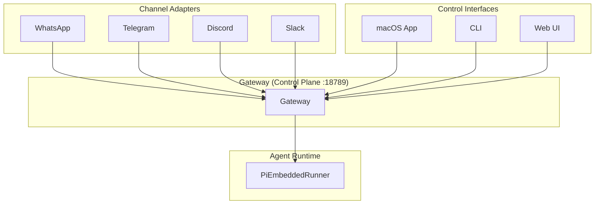

# 书籍配图指南

本文档提供基于官方OpenClaw架构的配图描述，可用于：
1. 使用专业绘图工具（如draw.io、Figma）重新绘制
2. 作为AI绘图工具的prompt参考
3. 在Markdown中嵌入Mermaid图表

官方参考资源：
- 官方文档：https://docs.openclaw.ai/concepts/architecture
- 架构详解：https://ppaolo.substack.com/p/openclaw-system-architecture-overview

---

## 一、OpenClaw整体架构图（Hub-and-Spoke）

### 官方架构说明
OpenClaw采用Hub-and-Spoke架构，Gateway作为中心控制平面（Control Plane），连接所有消息渠道、控制界面和Agent运行时。

### 正确的ASCII架构图
```
                              ┌─────────────────────────────────┐
                              │        Control Interfaces       │
                              │  ┌──────┐ ┌──────┐ ┌─────────┐  │
                              │  │macOS │ │ CLI  │ │  Web UI │  │
                              │  │ App  │ │      │ │ :18789  │  │
                              │  └──┬───┘ └──┬───┘ └────┬────┘  │
                              └─────┼────────┼──────────┼───────┘
                                    │        │          │
                              ┌─────┴────────┴──────────┴───────┐
                              │       WebSocket Protocol        │
                              │        JSON Schema Valid        │
                              └────────────────┬────────────────┘
                                               │
                    ┌──────────────────────────────────────────────────────┐
                    │                                                      │
                    │                     GATEWAY                          │
                    │                  (Control Plane)                     │
                    │                     :18789                           │
                    │                                                      │
                    │    • 连接管理  • 消息路由  • 访问控制               │
                    │    • 会话解析  • 事件推送  • 配置管理               │
                    │                                                      │
                    └──────────┬───────────────────────┬──────────────────┘
                               │                       │
         ┌─────────────────────┼───────────────────────┼─────────────────────┐
         │                     │                       │                     │
         ▼                     ▼                       ▼                     ▼
┌─────────────────┐  ┌─────────────────┐    ┌─────────────────┐   ┌─────────────────┐
│ Channel Adapters│  │  Agent Runtime  │    │     Nodes       │   │ Canvas Server   │
│                 │  │ (PiEmbeddedRun) │    │                 │   │     :18793      │
│ • WhatsApp      │  │                 │    │ • macOS/iOS     │   │                 │
│ • Telegram      │  │ • Session解析   │    │ • Android       │   │ • A2UI渲染      │
│ • Discord       │  │ • Context组装   │    │ • Headless      │   │ • HTML/WS推送   │
│ • Slack         │  │ • Model调用     │    │                 │   │                 │
│ • Signal        │  │ • Tool执行      │    │ • 相机/位置     │   │                 │
│ • iMessage      │  │ • 状态持久化    │    │ • 屏幕录制      │   │                 │
└─────────────────┘  └────────┬────────┘    └─────────────────┘   └─────────────────┘
        │                     │
        │                     │
        ▼                     ▼
┌─────────────────┐  ┌─────────────────┐
│   Credentials   │  │  Model Provider │
│  ~/.openclaw/   │  │                 │
│  credentials/   │  │ • Anthropic     │
│                 │  │ • OpenAI        │
│ • WhatsApp Auth │  │ • Gemini        │
│ • Bot Tokens    │  │ • DeepSeek      │
│ • OAuth Secrets │  │ • 本地模型      │
└─────────────────┘  └─────────────────┘
```

### 推荐Prompt（用于AI绘图）
> "A clean technical architecture diagram for OpenClaw AI Agent system. Hub-and-spoke topology with Gateway (Control Plane) at center on port 18789. Gateway connects to: Channel Adapters (WhatsApp, Telegram, Discord, Slack, iMessage icons), Agent Runtime box, Control Interfaces (macOS app, CLI, Web UI), Nodes (mobile devices), and Canvas Server on port 18793. Use modern flat design with teal (#23877B) as primary color, white background, professional software architecture diagram style. Show bidirectional arrows for WebSocket connections."

---

## 二、消息处理端到端流程图

### 官方流程
基于官方文档的消息处理6个阶段：Ingestion → Access Control → Context Assembly → Model Invocation → Tool Execution → Response Delivery

### ASCII流程图
```
┌─────────────────────────────────────────────────────────────────────────────────┐
│                        OpenClaw 消息处理流程 (End-to-End)                         │
└─────────────────────────────────────────────────────────────────────────────────┘

用户消息 ──►┌──────────────────┐
            │  Phase 1         │
            │  Ingestion       │ ─── Channel Adapter 解析消息、媒体、元数据
            │  (消息接收)       │
            └────────┬─────────┘
                     │
                     ▼
            ┌──────────────────┐
            │  Phase 2         │
            │  Access Control  │ ─── 检查Allowlist、配对状态、群组规则
            │  (访问控制)       │     未授权 → 拒绝/配对流程
            └────────┬─────────┘
                     │ ✓ 授权
                     ▼
            ┌──────────────────┐
            │  Session         │
            │  Resolution      │ ─── main / dm:channel:id / group:channel:id
            │  (会话解析)       │     每种会话类型有不同的沙箱策略
            └────────┬─────────┘
                     │
                     ▼
            ┌──────────────────┐
            │  Phase 3         │
            │  Context         │ ─── 加载: AGENTS.md, SOUL.md, TOOLS.md
            │  Assembly        │     注入: Skills, Memory Search结果
            │  (上下文组装)     │     组装: 完整System Prompt
            └────────┬─────────┘
                     │
                     ▼
            ┌──────────────────┐
            │  Phase 4         │
            │  Model           │ ─── 流式调用 LLM (Claude/GPT/Gemini等)
            │  Invocation      │     Token-by-token 响应
            │  (模型调用)       │
            └────────┬─────────┘
                     │
                     ▼
            ┌──────────────────┐
            │  Phase 5         │
            │  Tool            │ ─── 检测tool_calls → 执行工具
            │  Execution       │     可能: Docker沙箱隔离
            │  (工具执行)       │     结果流式返回模型
            └────────┬─────────┘
                     │
                     ▼
            ┌──────────────────┐
            │  Phase 6         │
            │  Response        │ ─── 格式化消息(适配Channel)
            │  Delivery        │     发送到用户
            │  (响应交付)       │     持久化会话状态
            └──────────────────┘
                     │
                     ▼
               用户收到响应
```

### 延迟预算参考（官方数据）
- Access Control: < 10ms
- Session Load: < 50ms
- Prompt Assembly: < 100ms
- First Token: 200-500ms
- Tool Execution: 100ms - 3s

---

## 三、Session类型与沙箱策略

### ASCII图示
```
┌─────────────────────────────────────────────────────────────────────────────┐
│                        Session Types & Sandboxing                           │
├─────────────────────────────────────────────────────────────────────────────┤
│                                                                             │
│  ┌─────────────────────┐                                                    │
│  │  main Session       │  • 完全主机访问                                    │
│  │  agent:<id>:main    │  • 无Docker开销                                    │
│  │                     │  • 操作员信任级别                                  │
│  │  🔓 Full Access     │                                                    │
│  └─────────────────────┘                                                    │
│                                                                             │
│  ┌─────────────────────┐                                                    │
│  │  DM Session         │  • 默认沙箱隔离                                    │
│  │  agent:<id>:<ch>:dm:│  • Docker容器执行                                  │
│  │  <identifier>       │  • 受限工具集                                      │
│  │                     │                                                    │
│  │  🔒 Sandboxed       │                                                    │
│  └─────────────────────┘                                                    │
│                                                                             │
│  ┌─────────────────────┐                                                    │
│  │  Group Session      │  • 强制沙箱隔离                                    │
│  │  agent:<id>:<ch>:   │  • 最高风险等级                                    │
│  │  group:<id>         │  • 网络通常禁用                                    │
│  │                     │                                                    │
│  │  🔒🔒 Strict Sandbox│                                                    │
│  └─────────────────────┘                                                    │
│                                                                             │
└─────────────────────────────────────────────────────────────────────────────┘
```

---

## 四、Docker沙箱架构（官方）

### ASCII示意图
```
┌─────────────────────────────────────────────────────────────────────────────┐
│                              Host Machine                                    │
│                                                                             │
│  ┌─────────────────────────────────────────────────────────────────────┐   │
│  │                         Gateway Process                              │   │
│  │                          (Port 18789)                                │   │
│  └──────────────────────────────┬──────────────────────────────────────┘   │
│                                 │                                           │
│                    Tool Execution Request                                    │
│                                 │                                           │
│                                 ▼                                           │
│  ┌─────────────────────────────────────────────────────────────────────┐   │
│  │                    Docker Container (Sandbox)                        │   │
│  │  ┌─────────────────────────────────────────────────────────────┐    │   │
│  │  │                     Isolated Environment                     │    │   │
│  │  │                                                              │    │   │
│  │  │   ┌─────────┐   ┌─────────┐   ┌─────────┐                   │    │   │
│  │  │   │  Bash   │   │  Files  │   │ Browser │                   │    │   │
│  │  │   │ Commands│   │(bind mount)│(optional)│                   │    │   │
│  │  │   └─────────┘   └─────────┘   └─────────┘                   │    │   │
│  │  │                                                              │    │   │
│  │  │   🔒 Isolation Boundary                                     │    │   │
│  │  │   • Filesystem: isolated / read-only bind                    │    │   │
│  │  │   • Network: disabled by default                             │    │   │
│  │  │   • Resources: CPU/Memory limits                             │    │   │
│  │  │   • Ephemeral: created/destroyed per session                 │    │   │
│  │  │                                                              │    │   │
│  │  └──────────────────────────────────────────────────────────────┘    │   │
│  └─────────────────────────────────────────────────────────────────────┘   │
│                                                                             │
│  🚫 Protected from sandbox:                                                 │
│     ~/.ssh  ~/.aws  ~/.kube  ~/.openclaw/credentials/                      │
│                                                                             │
└─────────────────────────────────────────────────────────────────────────────┘
```

---

## 五、System Prompt架构（官方）

### ASCII图示
```
┌─────────────────────────────────────────────────────────────────────────────┐
│                        System Prompt Composition                             │
├─────────────────────────────────────────────────────────────────────────────┤
│                                                                             │
│  ┌─────────────────────────────────────────────────────────────────────┐   │
│  │                     Workspace Configuration Files                    │   │
│  │  ┌───────────────┐ ┌───────────────┐ ┌───────────────┐              │   │
│  │  │   AGENTS.md   │ │   SOUL.md     │ │   TOOLS.md    │              │   │
│  │  │               │ │   (optional)  │ │   (optional)  │              │   │
│  │  │ Core rules    │ │ Personality   │ │ Tool usage    │              │   │
│  │  │ Constraints   │ │ Tone & style  │ │ conventions   │              │   │
│  │  └───────────────┘ └───────────────┘ └───────────────┘              │   │
│  └─────────────────────────────────────────────────────────────────────┘   │
│                                 │                                           │
│                                 ▼                                           │
│  ┌─────────────────────────────────────────────────────────────────────┐   │
│  │                        Dynamic Context                               │   │
│  │  ┌───────────────┐ ┌───────────────┐ ┌───────────────┐              │   │
│  │  │    Session    │ │    Skills     │ │    Memory     │              │   │
│  │  │    History    │ │ (selective)   │ │    Search     │              │   │
│  │  │               │ │               │ │               │              │   │
│  │  │ Conversation  │ │ skills/*/     │ │ Semantic      │              │   │
│  │  │ turns         │ │ SKILL.md      │ │ similarity    │              │   │
│  │  └───────────────┘ └───────────────┘ └───────────────┘              │   │
│  └─────────────────────────────────────────────────────────────────────┘   │
│                                 │                                           │
│                                 ▼                                           │
│  ┌─────────────────────────────────────────────────────────────────────┐   │
│  │                      Tool Definitions (auto-generated)               │   │
│  │  ┌───────────────────────────────┐ ┌───────────────────────────────┐ │   │
│  │  │     Built-in Tools            │ │     Plugin Tools              │ │   │
│  │  │  bash, browser, file, canvas  │ │  Custom capabilities          │ │   │
│  │  └───────────────────────────────┘ └───────────────────────────────┘ │   │
│  └─────────────────────────────────────────────────────────────────────┘   │
│                                 │                                           │
│                                 ▼                                           │
│  ┌─────────────────────────────────────────────────────────────────────┐   │
│  │                        Pi Agent Core                                 │   │
│  │                        (Base Instructions)                           │   │
│  └─────────────────────────────────────────────────────────────────────┘   │
│                                 │                                           │
│                                 ▼                                           │
│                     ┌─────────────────────┐                                 │
│                     │   Final System      │                                 │
│                     │   Prompt to Model   │                                 │
│                     └─────────────────────┘                                 │
│                                                                             │
└─────────────────────────────────────────────────────────────────────────────┘
```

---

## 六、部署架构选项（官方）

### 本地开发 / macOS生产
```
┌─────────────────────────────────────────────────────────────────┐
│                        Local Machine                             │
│                                                                 │
│   ┌─────────────────┐     ┌─────────────────┐                  │
│   │   macOS App     │     │      CLI        │                  │
│   │   (Menu Bar)    │     │                 │                  │
│   └────────┬────────┘     └────────┬────────┘                  │
│            │                       │                            │
│            └───────────┬───────────┘                            │
│                        │                                        │
│                        ▼                                        │
│            ┌─────────────────────┐                              │
│            │      Gateway        │◄───── WhatsApp/Bot Tokens   │
│            │    127.0.0.1:18789  │                              │
│            └─────────────────────┘                              │
│                                                                 │
└─────────────────────────────────────────────────────────────────┘
```

### VPS远程部署（SSH隧道）
```
┌─────────────────────┐                    ┌─────────────────────┐
│   Local Machine     │                    │      VPS/VM         │
│                     │                    │                     │
│  ┌───────────────┐  │   SSH Tunnel       │  ┌───────────────┐  │
│  │ CLI / Web UI  │  │ ────────────────►  │  │   Gateway     │  │
│  │               │  │   Port Forward     │  │ 127.0.0.1     │  │
│  │ localhost:    │  │   18789→18789      │  │    :18789     │  │
│  │    18789      │  │                    │  │               │  │
│  └───────────────┘  │                    │  └───────────────┘  │
│                     │                    │         │           │
│                     │                    │         ▼           │
│                     │                    │  ┌───────────────┐  │
│                     │                    │  │    Agent      │  │
│                     │                    │  │    Runtime    │  │
│                     │                    │  └───────────────┘  │
└─────────────────────┘                    └─────────────────────┘
```

### Fly.io容器部署
```
┌─────────────────────────────────────────────────────────────────┐
│                           Fly.io Cloud                          │
│                                                                 │
│    ┌───────────────────────────────────────────────────────┐   │
│    │                    Fly.io Edge                         │   │
│    │              Managed HTTPS Endpoint                    │   │
│    │                  (TLS Termination)                     │   │
│    └─────────────────────────┬─────────────────────────────┘   │
│                              │                                  │
│                              ▼                                  │
│    ┌───────────────────────────────────────────────────────┐   │
│    │               Docker Container                         │   │
│    │  ┌─────────────────────────────────────────────────┐  │   │
│    │  │              Gateway Process                    │  │   │
│    │  │                 :18789                          │  │   │
│    │  └─────────────────────────────────────────────────┘  │   │
│    │                         │                              │   │
│    │  ┌──────────────────────┴──────────────────────────┐  │   │
│    │  │           Persistent Volume                      │  │   │
│    │  │   ~/.openclaw/ (config, sessions, credentials)  │  │   │
│    │  └─────────────────────────────────────────────────┘  │   │
│    └───────────────────────────────────────────────────────┘   │
│                                                                 │
└─────────────────────────────────────────────────────────────────┘
```

---

## 七、Canvas与A2UI架构

### ASCII示意图
```
┌─────────────────────────────────────────────────────────────────────────────┐
│                        Canvas & A2UI Architecture                            │
├─────────────────────────────────────────────────────────────────────────────┤
│                                                                             │
│   Agent Runtime                                                             │
│        │                                                                    │
│        │ canvas.update({html: "..."})                                       │
│        ▼                                                                    │
│   ┌────────────────────────────────────────────────────────────────────┐   │
│   │                    Canvas Server (:18793)                           │   │
│   │                                                                    │   │
│   │   • 接收HTML内容                                                   │   │
│   │   • 解析A2UI属性                                                   │   │
│   │   • WebSocket推送到客户端                                          │   │
│   │                                                                    │   │
│   └────────────────────────────────────────────────────────────────────┘   │
│                                   │                                         │
│                                   │ WS Push                                 │
│                                   ▼                                         │
│   ┌─────────────────────────────────────────────────────────────────────┐  │
│   │                        Browser Clients                               │  │
│   │                                                                      │  │
│   │   ┌──────────────────────────────────────────────────────────┐     │  │
│   │   │  <div a2ui-component="task-list">                        │     │  │
│   │   │    <button a2ui-action="complete" a2ui-param-id="123">   │     │  │
│   │   │      Mark Complete                                       │     │  │
│   │   │    </button>                                             │     │  │
│   │   │  </div>                                                  │     │  │
│   │   └──────────────────────────────────────────────────────────┘     │  │
│   │                                                                      │  │
│   │   User Click ────────► Action Event ────────► Canvas Server        │  │
│   │                                                   │                  │  │
│   │                                                   ▼                  │  │
│   │                                          Tool Call to Agent         │  │
│   │                                                                      │  │
│   └──────────────────────────────────────────────────────────────────────┘  │
│                                                                             │
└─────────────────────────────────────────────────────────────────────────────┘
```

---

## 八、GEPA框架图（书籍原创概念）

### 文字描述
四象限循环图，展示自进化的四大支柱：Generation（执行）、Evaluation（评估）、Planning（规划）、Advancement（进化）。

### ASCII示意图
```
              ┌─────────────────────────────────────┐
              │                                     │
              │    ┌───────┐            ┌───────┐  │
              │    │   G   │            │   E   │  │
              │    │Generation         │Evaluation│
              │    │ 执行生成│──────────►│ 评估打分│  │
              │    └───────┘            └───────┘  │
              │         ▲                    │      │
              │         │                    ▼      │
              │    ┌───────┐            ┌───────┐  │
              │    │   A   │            │   P   │  │
              │    │Advancement        │Planning │  │
              │    │ 进化更新│◄──────────│ 诊断反思│  │
              │    └───────┘            └───────┘  │
              │                                     │
              └─────────────────────────────────────┘
```

---

## 九、实施建议

### 方案A：使用专业绘图工具
1. **draw.io** (免费) - https://app.diagrams.net/
2. **Figma** (免费) - https://figma.com
3. **Excalidraw** (免费) - https://excalidraw.com

### 方案B：使用Mermaid语法
书籍中可以直接嵌入Mermaid代码：



### 方案C：联系官方获取素材
OpenClaw官方网站可能有品牌素材和架构图：
- GitHub: https://github.com/openclaw/openclaw
- Discord社区可能有设计资源

---

## 配图统计

| 类型 | 数量 | 优先级 | 状态 |
|------|------|--------|------|
| 整体架构图 | 1 | P0 | 基于官方文档已设计 |
| 消息流程图 | 1 | P0 | 基于官方文档已设计 |
| Session/沙箱图 | 1 | P1 | 基于官方文档已设计 |
| 部署架构图 | 3 | P1 | 基于官方文档已设计 |
| Canvas/A2UI图 | 1 | P2 | 基于官方文档已设计 |
| GEPA框架图 | 1 | P2 | 书籍原创概念 |
| Dashboard截图 | 1 | P2 | 需要实际运行截图 |
| **合计** | **9** | - | - |

---

## 官方资源链接

- 官方文档：https://docs.openclaw.ai
- 架构详解：https://docs.openclaw.ai/concepts/architecture
- GitHub仓库：https://github.com/openclaw/openclaw
- 社区Discord：通过官网加入
